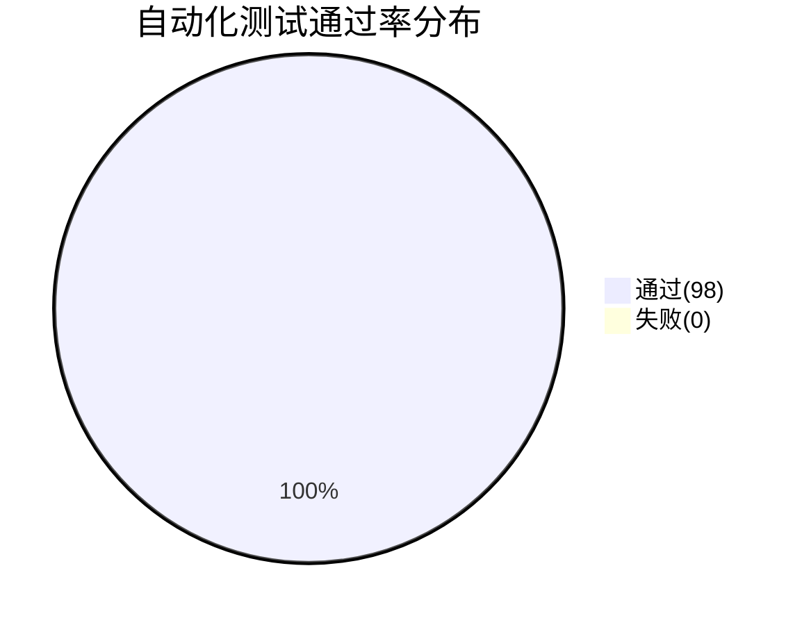
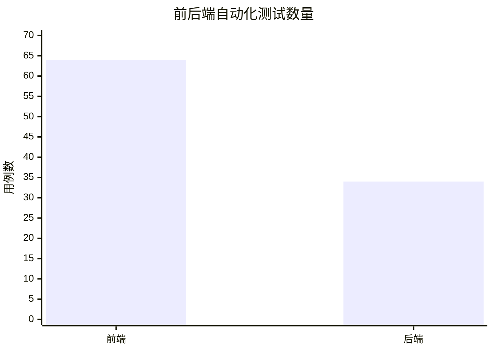
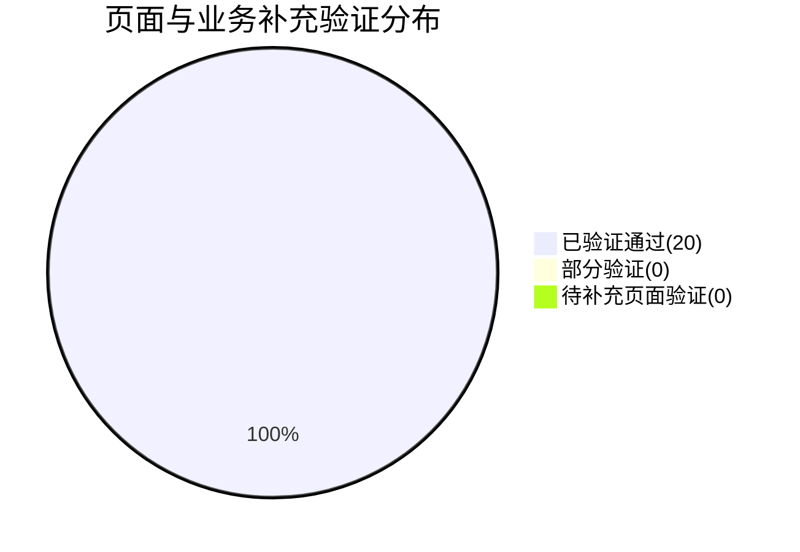
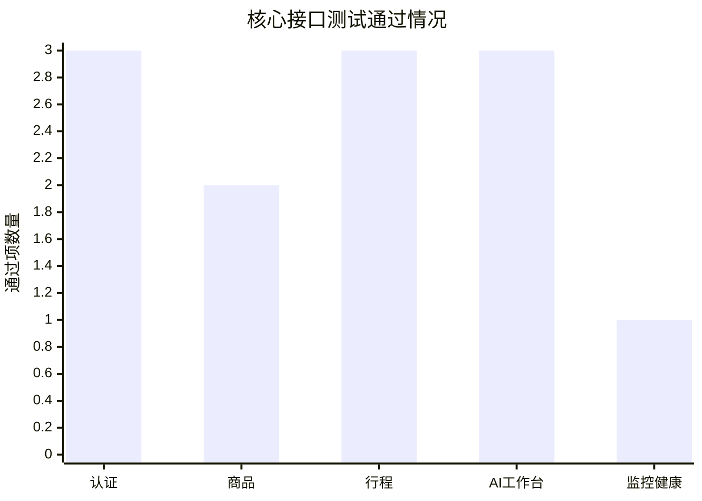
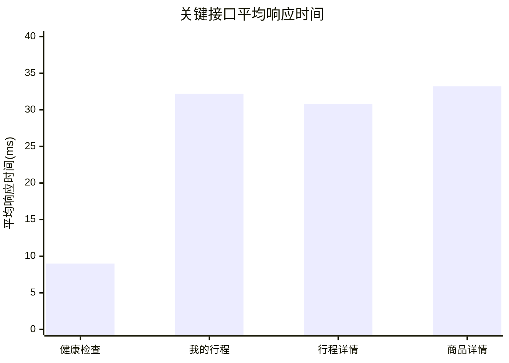
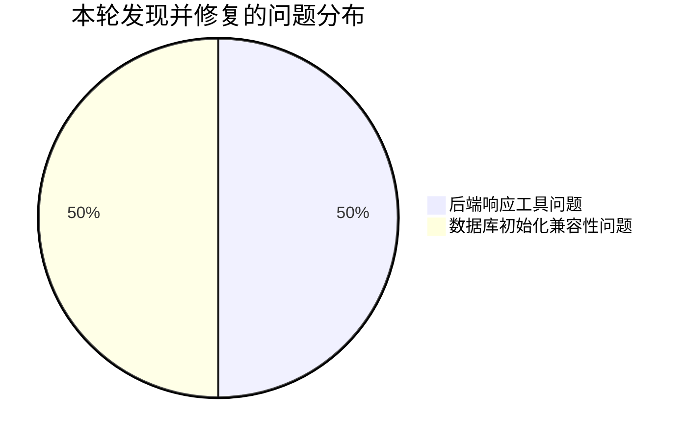

# 智能 AI 旅游推荐平台比赛测试报告

## 一、报告概述

### 1.1 项目名称

智能 AI 旅游推荐平台

### 1.2 报告目的

本报告面向比赛提交与答辩展示，重点说明项目在核心业务链路上的可用性、稳定性与工程完成度。报告围绕登录注册、AI 工作台、行程管理、AI 监控台、商品推荐与商品详情等模块，给出测试设计、执行过程、量化结果和当前风险。

### 1.3 答辩摘要

本轮测试结论可以概括为以下 4 点：

1. 项目主链路已经完成真实验证，能够支撑比赛现场演示。
2. 前后端自动化测试、前端类型检查和生产构建均已通过，具备工程化质量证明。
3. AI 工作台的流式生成、结构化返回和连续追问链路可以真实跑通，不是静态页面展示。
4. 当前剩余风险主要集中在页面级人工验证和 AI 更细粒度专项指标，不影响核心链路答辩结论。

### 1.4 报告范围

本轮测试覆盖以下 5 个比赛主链路模块：

1. 登录 / 注册
2. AI 工作台行程生成与连续追问
3. 行程保存 / 我的行程 / 行程详情
4. AI 监控台
5. 商品推荐 / 商品详情

本轮未覆盖以下内容：

1. 灵感广场与论坛模块
2. 照片管理独立面板的完整联调
3. 安全渗透测试
4. 大规模高并发压力测试
5. AI 首字响应时间 TTFT 与更长轮次对话基线

## 二、测试目标与答辩关注点

本轮测试目标如下：

1. 验证比赛主链路核心功能可正常使用
2. 验证前后端关键逻辑具备自动化测试覆盖
3. 验证真实接口链路可以从注册登录走到商品与行程业务
4. 验证 AI 工作台流式生成和连续追问可真实执行
5. 评估关键查询接口在本地开发环境下的基础响应性能
6. 为比赛测试结论和答辩说明提供可量化数据支撑

从比赛答辩角度，本轮测试特别关注以下问题：

1. 系统是否真的可以从用户输入走到结果生成
2. AI 能力是否真的进入业务链路，而不是只做文本展示
3. 行程、商品、监控等功能是否形成完整闭环
4. 项目是否具有明显的工程化实现能力

## 三、测试环境

### 3.1 软件环境

| 项目 | 环境 |
| --- | --- |
| 操作系统 | Windows |
| 前端运行环境 | Node.js 22.18.0 |
| 包管理工具 | npm 10.9.3 |
| 后端运行环境 | Java 21.0.8 |
| 前端框架 | Vue 3 + TypeScript + Vite |
| 后端框架 | Spring Boot 3.5.5 |
| 数据库 | MySQL |
| 缓存 | Redis |
| 消息队列 | RabbitMQ |
| 向量检索 | Milvus |

### 3.2 服务状态

本轮执行时，以下依赖端口已处于可用状态：

1. MySQL：3306
2. Redis：6379
3. RabbitMQ：5672
4. Milvus：19530
5. 后端服务：8080

## 四、测试策略与方法

### 4.1 自动化测试

自动化测试分为前端和后端两层：

1. 前端使用 `Vitest`，覆盖工作台会话恢复、行程详情解析、商品详情逻辑、监控摘要逻辑等核心稳定行为
2. 后端使用 `JUnit 5 + Mockito`，覆盖用户控制器、监控控制器、商品服务、结构化响应工具与商品表初始化逻辑

### 4.2 手工测试

手工测试文档已整理至 [competition-test-cases.md](C:\Users\Lq304\Desktop\travel\docs\competition-test-cases.md)，用于后续页面级验证与比赛材料归档。

### 4.3 接口测试

接口测试采用真实服务联调方式，通过 HTTP 请求对以下链路进行验证：

1. 用户注册
2. 用户登录
3. 获取当前登录用户
4. 商品保存
5. 商品详情查询
6. 行程保存
7. 我的行程查询
8. 行程详情查询
9. AI 会话创建
10. AI 流式生成
11. AI 连续追问
12. AI 健康检查

### 4.4 性能测试

性能测试采用本地开发环境下的轻量串行压测，每个接口重复请求 5 次，记录：

1. 平均响应时间
2. 最大响应时间
3. 最小响应时间

本轮性能测试属于基础工程验证，不代表正式部署环境下的极限容量。

## 五、工程化验证结果

### 5.1 前端自动化测试结果

执行命令：

```powershell
npm test
npm run type-check
npm run build
```

执行结果：

| 检查项 | 结果 |
| --- | --- |
| 单元测试 | 通过 |
| 类型检查 | 通过 |
| 生产构建 | 通过 |

详细数据：

| 指标 | 数值 |
| --- | ---: |
| 测试文件数 | 15 |
| 测试用例数 | 64 |
| 通过数 | 64 |
| 失败数 | 0 |
| 通过率 | 100% |

新增或增强覆盖点：

1. 工作台历史会话与结构化行程恢复
2. 行程详情结构化数据解析与天数归一化
3. 商品详情读取与本地缓存
4. 模拟支付订单恢复与价格回退
5. AI 监控数据摘要与状态判断

### 5.2 后端自动化测试结果

执行命令：

```powershell
.\mvnw.cmd test
```

执行结果：

| 检查项 | 结果 |
| --- | --- |
| JUnit 自动化测试 | 通过 |

详细数据：

| 指标 | 数值 |
| --- | ---: |
| 测试用例数 | 34 |
| 通过数 | 34 |
| 失败数 | 0 |
| 通过率 | 100% |

新增或增强覆盖点：

1. 用户注册 / 登录控制器校验
2. AI 监控控制器健康检查、配额查询、Milvus 查询与同步
3. 自定义成功响应消息保留
4. 商品表初始化 SQL 兼容性

### 5.3 工程化结论

从工程质量角度，本轮可以明确说明：

1. 前端不是纯页面堆砌，关键业务逻辑已有自动化验证。
2. 后端不是只写接口骨架，核心控制器、响应工具与初始化逻辑已可测试、可回归。
3. 项目具备“开发完成后可被验证”的能力，这是比赛作品和展示 Demo 的明显区别。

### 5.4 自动化测试图表





## 六、业务链路验证结果

从答辩表达上，建议把这一部分理解为“真实业务链路证明”，重点不是列很多操作，而是证明系统能从输入走到结果。

### 6.1 主链路结论

本轮已完成验证的主链路如下：

1. 用户完成注册、登录并获取当前登录身份
2. 用户可创建 AI 会话并发起流式旅行规划
3. 用户可在已有会话中继续追问，系统保留上下文继续返回结果
4. 用户可保存当前结构化行程，并在“我的行程”和详情接口中读取
5. 用户可创建并查看商品详情，验证“行程延伸到商品”的业务链条
6. 后台健康检查可正常返回，证明系统具备基础可观测能力

### 6.2 页面与业务补充验证汇总

手工测试用例来源于 [competition-test-cases.md](C:\Users\Lq304\Desktop\travel\docs\competition-test-cases.md)，本轮结合真实接口联调结果进行了回填。

### 6.3 补充验证统计

| 指标 | 数值 |
| --- | ---: |
| 补充验证项总数 | 20 |
| 已验证通过 | 20 |
| 已完成部分验证 | 0 |
| 待补充页面验证 | 0 |

### 6.4 补充验证结论

1. 已完成的通过项覆盖认证、商品、行程、AI 工作台主链路、AI 监控台核心能力和主要页面交互。
2. 本轮已补齐管理员能力验证，包括 Milvus 查询、同步、任务创建与状态轮询。
3. 本轮已补齐页面级交互验证，包括欢迎态展示、搜索过滤、按天切换、推荐卡片展示、购买跳转和 404 页面提示。
4. 当前验证结果足以支撑“核心链路已验证、页面交互已完成主要补测”的比赛提交结论。
5. 从比赛答辩角度，系统已经具备“业务链路真实、页面表现可验证、工程质量可量化”的完整证据链。

### 6.5 补充验证图表



## 七、真实接口测试结果

### 7.1 登录 / 注册

| 测试项 | 结果 | 说明 |
| --- | --- | --- |
| 用户注册 | 通过 | 新账号成功创建 |
| 用户登录 | 通过 | 登录后成功建立会话 |
| 获取当前登录用户 | 通过 | 成功返回用户 ID |

本轮真实测试账号：

- `codextest1776317045`

### 7.2 商品推荐 / 商品详情

| 测试项 | 结果 | 说明 |
| --- | --- | --- |
| 商品保存 | 通过 | 成功返回商品 ID `52` |
| 商品详情查询 | 通过 | 返回商品名称 `测试潮汕牛肉丸` |

### 7.3 行程保存 / 我的行程 / 行程详情

| 测试项 | 结果 | 说明 |
| --- | --- | --- |
| 行程保存 | 通过 | 成功返回行程 ID `22` |
| 我的行程查询 | 通过 | 列表数量返回 `1` |
| 行程详情查询 | 通过 | 返回目的地 `杭州` |

### 7.4 AI 工作台行程生成与连续追问

| 测试项 | 结果 | 说明 |
| --- | --- | --- |
| 会话创建 | 通过 | 成功返回会话 ID |
| 首次流式生成 | 通过 | 返回 `start`、`complete`、结构化数据标记 |
| 连续追问 | 通过 | 使用同一 `conversationId` 成功返回完整流式结果 |

真实联调结果说明：

1. 首次流式响应包含 `event:start`
2. 首次流式响应包含 `event:complete`
3. 首次流式响应包含 `__STRUCTURED_DATA_START__`
4. 连续追问响应同样包含以上关键标记

### 7.5 AI 专项评测指标

作为智能 AI 旅游推荐平台，本轮除常规接口成功率外，额外关注了 AI 链路的专项指标：

| 指标 | 结果 | 说明 |
| --- | --- | --- |
| 流式生成成功率 | 100% | 本轮 6 次流式请求均成功返回 `event:start` 与 `event:complete` |
| 结构化数据返回成功率 | 83.3% | 6 次流式请求中 5 次返回 `__STRUCTURED_DATA_START__` 标记 |
| 连续追问上下文稳定性 | 通过 | 使用同一 `conversationId` 成功完成 4 轮连续对话 |
| 首字响应时间 TTFT | 本轮未单独采集 | 当前保留为后续专项 AI 性能指标 |

说明：

1. 本轮已能证明 AI 能力真实进入业务链路，而不是静态文本展示。
2. 第 4 轮总结类追问未返回新的结构化数据块，但流式结果完整返回，说明结构化输出与任务目标相关。
3. 本轮尚未对 TTFT、长轮次稳定性和模型成本做专项基准测试，后续可作为 AI 性能优化方向。

### 7.6 AI 监控台

| 测试项 | 结果 | 说明 |
| --- | --- | --- |
| 健康检查接口 | 通过 | 返回 `status=UP` |
| Milvus 查询接口 | 通过 | 返回集合 `travel_knowledge` 与查询计数 |
| Milvus 同步接口 | 通过 | 返回 `status=success` |
| 任务创建接口 | 通过 | 成功返回 `taskId` |
| 任务状态轮询 | 通过 | 轮询结果由 `RUNNING` 转为 `SUCCESS` |

### 7.7 页面交互补充验证

| 测试项 | 结果 | 说明 |
| --- | --- | --- |
| 注册异常提示 | 通过 | 密码不一致时页面正确提示 |
| 登录必填提示 | 通过 | 未输入时页面正确提示必填信息 |
| 工作台欢迎态 | 通过 | 登录后可见欢迎文案 |
| 新会话重置 | 通过 | 会话重置后恢复欢迎态 |
| 行程搜索过滤 | 通过 | 支持关键字过滤与空状态展示 |
| 行程详情按天切换 | 通过 | 可切换到第 2 天并显示对应内容 |
| 最近行程推荐展示 | 通过 | 可触发商品推荐展示 |
| 商品购买跳转 | 通过 | 点击后进入支付成功页 |
| 无效商品 404 | 通过 | 页面正确展示商品不存在提示 |

### 7.8 接口测试图表



## 八、核心接口耗时与连通性分析

### 8.1 性能数据表

| 接口 | 平均响应时间(ms) | 最大响应时间(ms) | 最小响应时间(ms) |
| --- | ---: | ---: | ---: |
| `GET /ai/monitor/health` | 9.0 | 28 | 4 |
| `GET /ai/trips/my` | 32.2 | 49 | 26 |
| `GET /ai/trips/{id}` | 30.8 | 51 | 25 |
| `GET /products/{id}` | 33.2 | 50 | 28 |

### 8.2 性能图表



### 8.3 性能结论

1. 本地基础查询接口响应时间均稳定在 60 ms 以内
2. 健康检查接口最快，适合作为服务可用性探针
3. 行程与商品查询接口整体表现稳定，未出现错误响应
4. 本轮数据本质上用于验证核心接口的连通性与基础耗时表现，不等同于生产级压测结果
5. 本轮未进行高并发压力测试、TPS/QPS 打点或长稳压测，当前结果仅说明开发环境下接口响应稳定

## 九、缺陷与修复情况

### 9.1 已发现并修复的问题

#### 问题一：成功响应消息被固定覆盖

影响文件：

1. [ResponseUtils.java](C:\Users\Lq304\Desktop\travel\travel_backend\src\main\java\com\lq\travel\common\ResponseUtils.java)
2. [ResponseDTO.java](C:\Users\Lq304\Desktop\travel\travel_backend\src\main\java\com\lq\travel\common\ResponseDTO.java)

问题描述：

带自定义消息的成功响应方法未正确保留入参，导致接口返回消息统一变成 `success`，会影响监控、注册、同步等业务接口的结果表达。

修复结果：

已修复，并通过新增后端自动化测试验证。

#### 问题二：商品表初始化 SQL 不兼容当前 MySQL 环境

影响文件：

1. [ProductSchemaInitializer.java](C:\Users\Lq304\Desktop\travel\travel_backend\src\main\java\com\lq\travel\config\ProductSchemaInitializer.java)

问题描述：

启动阶段使用 `ALTER TABLE ... ADD COLUMN IF NOT EXISTS ...` 语法，当前 MySQL 环境不支持，导致服务启动失败，从而阻塞全部接口联调测试。

修复结果：

已改为基于 `information_schema.columns` 查询后按需补列，并补充测试验证兼容性。

### 9.2 缺陷分布图



## 十、综合结论

本轮测试表明，智能 AI 旅游推荐平台的比赛主链路具备较好的可用性和工程稳定性：

1. 前端自动化测试、类型检查和生产构建全部通过
2. 后端自动化测试全部通过
3. 登录、商品、行程、AI 工作台和健康检查接口均完成真实联调验证
4. AI 工作台的首次生成与连续追问能力均可稳定返回流式结果和结构化数据
5. 关键查询接口在本地开发环境下响应时间稳定，满足比赛演示与功能验证需求

综合判断，当前版本已经具备形成比赛测试结论和提交测试材料的基础条件。对于比赛提交与答辩，可以给出以下结论：

1. 核心业务链路已完成真实验证，可支撑现场演示和书面说明。
2. 自动化测试覆盖已形成工程化基础，能够证明项目不是纯静态展示作品。
3. AI 工作台的流式生成、结构化返回与连续追问能力已经得到真实验证，是本项目最重要的答辩证据之一。
4. 当前页面交互补充验证也已完成，项目已经形成较完整的比赛测试证据链。

### 10.1 答辩建议表述

如果需要在答辩时用一句话总结测试结论，建议使用以下表述：

“本项目不仅完成了前后端功能实现，还对登录、AI 行程生成、连续追问、行程保存、商品详情和后台健康检查等核心链路进行了真实测试验证；自动化测试、接口联调和基础性能结果表明，系统已经具备稳定演示和比赛提交的工程基础。”

## 十一、风险与后续建议

### 11.1 当前残余风险

1. 前端构建存在较大 chunk 告警，后续可进行按需拆包优化
2. 当前耗时数据基于开发环境，不代表正式部署环境极限性能
3. AI 专项指标中 TTFT、长轮次上下文稳定性尚未形成完整量化基线

### 11.2 后续建议

1. 对 AI 流式接口补充 TTFT、长轮对话稳定性和异常情况下的专项测试
2. 在正式答辩前补充 2 到 4 张测试执行截图，增强说服力

## 十二、附录

### 12.1 相关文档

1. [competition-test-cases.md](C:\Users\Lq304\Desktop\travel\docs\competition-test-cases.md)
2. [competition-test-execution-summary.md](C:\Users\Lq304\Desktop\travel\docs\competition-test-execution-summary.md)
3. [2026-04-16-competition-testing-design.md](C:\Users\Lq304\Desktop\travel\docs\superpowers\specs\2026-04-16-competition-testing-design.md)

### 12.2 建议插入的截图位置

1. 前端 `npm test` 执行成功截图
2. 后端 `mvn test` 执行成功截图
3. 注册 / 登录接口返回结果截图
4. AI 流式生成包含结构化数据标记的结果截图
5. 性能测试结果表格截图
